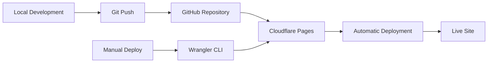

# K-12 E-Signature Forms Optimization Tool

[](https://school-esignature-analysis.pages.dev/)
[](https://opensource.org/licenses/MIT)
[](https://school-esignature-analysis.pages.dev/)
[](https://school-esignature-analysis.pages.dev/)

## 🎯 Overview

This interactive tool helps K-12 schools optimize their e-signature workflows by analyzing form usage patterns and providing data-driven recommendations. Built from a comprehensive study of **15,131 real transactions** at Singapore American School, this tool can analyze any school's e-signature data to identify optimization opportunities while maintaining legal compliance.

### 🔥 **Key Features**
- **📊 Interactive Analysis Dashboard** - Filter, sort, and explore form data
- **🔄 CSV Upload & Analysis** - Upload your school's data for instant recommendations
- **🤖 Smart Classification Algorithm** - Automatically categorizes forms based on best practices
- **📈 Optimization Metrics** - Calculate potential e-signature reduction percentage
- **🔒 Compliance-First Approach** - Preserves signatures for legal requirements
- **📱 Mobile Responsive** - Works on all devices for stakeholder review
- **⚡ Cloudflare-Powered** - Lightning-fast global delivery and enhanced security

## 🚀 Live Demo Available

**[View Interactive Analysis →](https://school-esignature-analysis.pages.dev/)**

Experience the full functionality including:
- Sample data analysis from Singapore American School
- CSV upload for your own school's data
- Interactive filtering and sorting
- Real-time optimization recommendations

## 📊 Case Study Results

### Singapore American School Analysis
- **Total Transactions Analyzed:** 15,131
- **Optimization Potential:** 40.7% reduction in e-signature requirements
- **Forms Optimized:** 6,161 converted to approval workflows
- **Compliance Maintained:** 100% for contracts, consents, and legal documents

### Key Optimizations Identified
| Form Type | Volume | Recommendation | Rationale |
|-----------|--------|----------------|-----------|
| Digital Citizenship Agreement | 1,239 | → Approval | Policy acknowledgment |
| Passport Information Updates | 1,651 | → Approval | Document updates |
| Athletic Code of Conduct | 705 | → Approval | Code acknowledgment |
| Device Acceptance Forms | 251 | → Approval | Responsibility agreement |
| **Faculty Contracts** | 213 | **Keep Signature** | **Legal requirement** |
| **Parent Consents** | 620 | **Keep Signature** | **Legal requirement** |

## 🔄 How to Analyze Your School's Data

### Step 1: Export Your Data
Export a CSV file from your e-signature platform (DocuSign, Adobe Sign, etc.) with these columns:
```csv
Form Name, Count, Type (optional)
Digital Citizenship Agreement, 1239
Faculty Contract, 213, Contract
Device Acceptance Form, 173
Parent Permission Form, 89, Consent
```

### Step 2: Upload & Analyze
1. Visit the [live tool](https://school-esignature-analysis.pages.dev/)
2. Click "Upload Your School's Data"
3. Drag & drop or select your CSV file
4. Get instant analysis with optimization recommendations

### Step 3: Review Results
- **Optimization Percentage** - See your potential e-signature reduction
- **Form-by-Form Analysis** - Detailed recommendations for each form type
- **Implementation Priority** - High-impact changes identified first
- **Compliance Protection** - Legal documents automatically preserved

## 🤖 Smart Classification Algorithm

The tool uses an intelligent algorithm to categorize forms based on educational best practices:

### ✅ **Convert to Approval Workflow**
- **Policy Acknowledgments**: Digital citizenship, codes of conduct, handbooks
- **Administrative Processes**: Device forms, reimbursements, professional development
- **Information Updates**: Contact details, passport information, emergency contacts
- **High-Volume Routine**: Forms with >500 transactions likely suitable for approval

### ✍️ **Preserve as E-Signature**
- **Employment Contracts**: Faculty, staff, coach agreements
- **Parent Consents**: Field trips, medical permissions, activity waivers
- **Legal Documents**: Board petitions, vendor agreements, financial contracts
- **Student Contracts**: Transcript releases, program participation agreements

### 🎯 **Classification Criteria**
- **Keyword Analysis**: Scans form names for legal/contractual terms
- **Volume Assessment**: High-volume forms prioritized for optimization
- **Risk Evaluation**: Conservative approach for unclear classifications
- **Educational Context**: Designed specifically for K-12 school environments

## 📈 Expected Benefits

### Quantitative Improvements
- **30-50% reduction** in e-signature processing time
- **Faster approvals** for routine acknowledgments (60% speed increase)
- **Reduced support tickets** for signing issues (30% decrease)
- **Lower administrative overhead** for policy updates

### Qualitative Enhancements
- **Improved user experience** for staff and parents
- **Streamlined workflows** for routine processes
- **Enhanced compliance tracking** with audit trails
- **Better resource allocation** for complex documents

## ☁️ Cloudflare Pages Deployment

This project is optimized for deployment on **Cloudflare Pages**, providing:

- **⚡ Global CDN** - Lightning-fast delivery worldwide
- **🔒 Enhanced Security** - Built-in DDoS protection and security headers
- **🚀 Automatic Deployments** - Connected to GitHub for seamless updates
- **📊 Analytics** - Built-in web analytics and performance monitoring
- **🔧 Edge Functions** - Server-side functionality at the edge
- **💰 Cost-Effective** - Generous free tier for educational projects

### 🛠️ Deployment Setup

#### Prerequisites
- Node.js 16+ installed
- Git repository
- Cloudflare account

#### Quick Deployment
```bash
# Clone the repository
git clone https://github.com/bryanfawcett/school-esignature-analysis.git
cd school-esignature-analysis

# Install Wrangler CLI (Cloudflare's deployment tool)
npm install -g wrangler

# Login to Cloudflare
wrangler auth login

# Deploy to Cloudflare Pages
npm run deploy

# Or use the deployment script
chmod +x deploy.sh
./deploy.sh
```

#### Automated GitHub Deployment
1. **Fork this repository** to your GitHub account
2. **Connect to Cloudflare Pages:**
   - Go to [Cloudflare Pages](https://pages.cloudflare.com/)
   - Click "Create a project"
   - Connect your GitHub account
   - Select the forked repository
3. **Configure build settings:**
   - Build command: `echo "No build required"`
   - Build output directory: `/`
   - Root directory: `/`
4. **Deploy:** Cloudflare will automatically deploy on every push to main

#### Environment Configuration
```bash
# Create wrangler.toml for custom configuration
name = "school-esignature-analysis"
compatibility_date = "2024-01-15"

[env.production]
name = "school-esignature-analysis"

# Custom domain (optional)
[[route]]
pattern = "your-domain.com/*"
zone_name = "your-domain.com"
```

### 📊 Available Scripts

```bash
# Development server
npm run dev                 # Start local development server

# Deployment
npm run deploy             # Deploy to production
npm run deploy preview     # Deploy to preview environment

# Local testing
npm start                  # Start simple HTTP server
python -m http.server 8000 # Alternative local server
```

## 🛠️ Technical Implementation

### Built With
- **Frontend**: HTML5, CSS3, JavaScript (ES6+)
- **Styling**: Responsive CSS Grid/Flexbox
- **Data Processing**: Client-side CSV parsing
- **Deployment**: Cloudflare Pages with Wrangler CLI
- **Analytics**: Cloudflare Web Analytics (optional)
- **Security**: Content Security Policy, security headers

### Architecture
```
school-esignature-analysis/
├── index.html              # Main application page
├── styles.css              # Responsive styling
├── script.js               # Interactive functionality
├── wrangler.toml           # Cloudflare configuration
├── package.json            # Project configuration
├── deploy.sh               # Deployment script
├── functions/              # Cloudflare Pages Functions
│   └── _middleware.js      # Security headers and analytics
├── sample-data/            # Example CSV files
│   └── sample.csv
└── README.md               # Documentation
```

### Key Features
- **Drag & Drop Upload**: Modern file handling with progress indicators
- **Real-time Analysis**: Client-side processing for instant results
- **Responsive Design**: Works on desktop, tablet, and mobile
- **Keyboard Shortcuts**: Power user features (Ctrl+1,2,3,4,5)
- **Search Functionality**: Find specific forms quickly
- **Export Ready**: Results suitable for presentation to stakeholders
- **Edge Security**: Enhanced security headers via Cloudflare Functions

## 🌐 Browser Compatibility
- ✅ Chrome 80+ (Full support)
- ✅ Firefox 75+ (Full support)
- ✅ Safari 13+ (Full support)
- ✅ Edge 80+ (Full support)
- ✅ Mobile browsers (Responsive design)

## 🎓 Educational Use Cases

### For School Administrators
- **Policy Implementation**: Streamline handbook acknowledgments
- **Compliance Reviews**: Ensure legal documents maintain proper signatures
- **Efficiency Planning**: Identify highest-impact optimization opportunities
- **Cost Analysis**: Calculate potential time and resource savings

### For IT Departments
- **System Optimization**: Reduce e-signature platform loads
- **User Support**: Minimize confusion with simpler workflows
- **Integration Planning**: Identify forms suitable for different systems
- **Change Management**: Data-driven approach to workflow changes

### For Legal/Compliance Teams
- **Risk Assessment**: Verify legal requirements are preserved
- **Audit Preparation**: Document workflow decisions with data
- **Policy Updates**: Ensure new processes maintain compliance
- **Training Materials**: Use results for staff education

## 📊 Sample CSV Templates

### Basic Format
```csv
Form Name,Count
Digital Citizenship Agreement,1239
Faculty Contract,213
Device Acceptance Form,173
```

### Extended Format
```csv
Form Name,Count,Current Type,Department
Digital Citizenship Agreement,1239,E-signature,Student Services
Faculty Contract,213,E-signature,Human Resources
Device Acceptance Form,173,E-signature,Technology
Parent Permission Form,89,E-signature,Student Services
```

## 🤝 Contributing

We welcome contributions from the educational technology community!

### Ways to Contribute
- **Submit CSV Data**: Help improve classification algorithms
- **Report Issues**: Found a bug or have a suggestion?
- **Feature Requests**: Ideas for new functionality
- **Documentation**: Improve setup and usage guides

### Development Setup
1. **Fork the repository**
2. **Clone your fork:**
   ```bash
   git clone https://github.com/YOUR-USERNAME/school-esignature-analysis.git
   cd school-esignature-analysis
   ```
3. **Install dependencies:**
   ```bash
   npm install -g wrangler
   ```
4. **Start development server:**
   ```bash
   npm run dev
   ```
5. **Make changes and test locally**
6. **Deploy to preview environment:**
   ```bash
   ./deploy.sh preview
   ```
7. **Create pull request**

### Deployment Workflow


## 📞 Support & Contact

### Get Help
- **📖 Documentation**: Check this README for setup and usage
- **💬 Issues**: Open a GitHub issue for bugs or questions
- **📧 Email**: Contact project maintainers for collaboration
- **🌐 Live Site**: [school-esignature-analysis.pages.dev](https://school-esignature-analysis.pages.dev/)

### Project Maintainers
- **Primary Developer**: [Bryan Fawcett](https://github.com/bryanfawcett)
- **Institution**: Singapore American School
- **Department**: Educational Technology

## 📄 License

This project is licensed under the MIT License - see the [LICENSE](LICENSE) file for details.

### MIT License Summary
- ✅ **Commercial Use**: Use in your school or organization
- ✅ **Modification**: Adapt for your specific needs
- ✅ **Distribution**: Share with other schools
- ✅ **Private Use**: Use internally without restrictions

## 🙏 Acknowledgments

### Technology Partners
- **Cloudflare Pages**: Hosting and global content delivery
- **GitHub**: Version control and collaboration platform
- **Singapore American School**: Real transaction data and use case validation

### Data Sources
- **Educational Technology Community**: Best practices and feedback
- **Open Source Libraries**: Client-side CSV parsing and UI components

### Special Thanks
- **School Administration**: Support for data sharing and transparency
- **IT Department**: Technical insights and implementation guidance
- **Legal Affairs**: Compliance review and validation
- **Faculty & Staff**: Operational requirements and user feedback